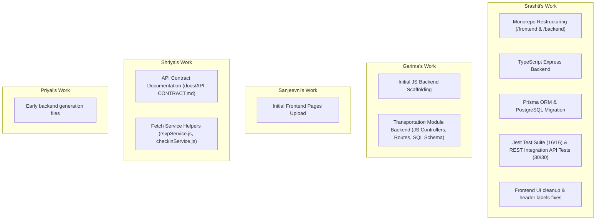

# Git Repository Audit Report: EventHub360

This report provides a comprehensive Git audit of the **EventHub360** repository (`eventhub360-gst`). It details the current branches, commit analysis, merge safety evaluation, and a proposed path forward to safely consolidate all team members' work without code loss.

---

## 1. Repository Overview

| Parameter | Value |
|---|---|
| **Repository Name** | `eventhub360-gst` |
| **Local Working Directory** | `C:\Users\srashti\.gemini\antigravity-ide\scratch\eventhub360-gst` |
| **Fetch Remote URL** | `https://github.com/Srashti16a/eventhub360-gst.git` |
| **Push Remote URL** | `https://github.com/Srashti16a/eventhub360-gst.git` |
| **Remote Default Branch** | `garima-backend` |
| **Current Local Branch** | `feature/postgresql-pgadmin-setup` |
| **Working Directory Status** | Uncommitted modifications (local SQLite DB `backend/prisma/dev.db`, untracked migration backups, and presentation documentation). |

### Branch Inventory
* **Local Branches:**
  1. `feature/postgresql-pgadmin-setup` (Current HEAD)
  2. `feature/frontend-backend-integration`
  3. `main`
* **Remote Branches (GitHub):**
  1. `origin/garima-backend` (Default HEAD on origin)
  2. `origin/frontend-combined`
  3. `origin/feature/frontend-backend-integration`
  4. `origin/priyal-backend`
  5. `origin/priyal-antigravity-backend`

---

## 2. Branch Comparison

A detailed inspection of the commit history and file structures shows that the repository contains **four disconnected history lineages** (commits without a common Git ancestor). This means standard Git merges will reject operations with `"refusing to merge unrelated histories"` unless forced.

Below is the evaluation of each branch:

| Branch Name | Latest Commit Hash | Last Modified Date | Ahead / Behind Default (`garima-backend`) | Pushed to GitHub? | Frontend Changes? | Backend Changes? | API / CRUD Integration? | PostgreSQL Migration? | Ready to Merge? |
|---|---|---|---|---|---|---|---|---|---|
| **`feature/postgresql-pgadmin-setup`** (Local) | `8e6227e` | 2026-06-27 | 6 Ahead / 3 Behind | **No** | Yes (subdirectories) | Yes (TypeScript & Prisma) | Yes (Connected API, validation) | **Yes** (Full Prisma PostgreSQL setup) | **No** (Needs manual porting of missing work) |
| **`feature/frontend-backend-integration`** (Local/Remote) | `bada448` | 2026-06-24 | 3 Ahead / 3 Behind | **Yes** | Yes (subdirectories) | Yes (TypeScript & Prisma) | Yes (CORS, Guest API Integration) | No (Uses SQLite) | **No** (Outdated by PostgreSQL branch) |
| **`main`** (Local) | `354e3e2` | 2026-06-24 | 2 Ahead / 3 Behind | **No** | Yes (subdirectories) | Yes (TypeScript) | No (Basic verification only) | No (SQLite) | **No** (Outdated) |
| **`origin/frontend-combined`** (Remote) | `cf6f6c0` | 2026-06-27 | 3 Ahead / 1 Behind | **Yes** | Yes (root `src/`) | Yes (older JS backend) | Yes (Shriya's fetch services added) | No (Raw SQL schemas) | **No** (Requires manual extraction of services) |
| **`origin/garima-backend`** (Remote) | `1a7a674` | 2026-06-23 | 0 Ahead / 0 Behind | **Yes** | No | Yes (JS backend) | No (Backend routes only) | No (Raw SQL schemas) | **No** (Requires porting to TypeScript backend) |
| **`origin/priyal-backend`** (Remote) | `37f361a` | 2026-06-22 | 0 Ahead / 2 Behind | **Yes** | No | Yes (JS backend) | No | No | **No** (Outdated duplicate of Garima's branch) |
| **`origin/priyal-antigravity-backend`** (Remote) | `e81ed45` | 2026-06-23 | 1 Ahead / 3 Behind | **Yes** | No | Yes (JS scaffolding) | No | No | **No** (Outdated boilerplate) |

---

## 3. Difference Analysis

### Comparison Summary Table

| Branch | Unique Changes | Missing Changes | Ready to Merge? |
|---|---|---|---|
| **`feature/postgresql-pgadmin-setup`** | TypeScript monorepo, Prisma ORM, PostgreSQL setup & seed scripts, Jest tests, Swagger API documentation. | Garima's backend transportation modules; Shriya's RSVP/Check-in client services. | **No** (Requires manual integration) |
| **`origin/frontend-combined`** | Shriya's API fetch service client files (`src/services/rsvpService.js`, `src/services/checkinService.js`). | TypeScript backend rewrite, PostgreSQL Prisma schemas, unit testing suite. | **No** (Folder structure conflict) |
| **`origin/garima-backend`** | Complete transportation and fleet management backend module (JavaScript, raw SQL). | React frontend application, Prisma schema setup, unit tests. | **No** (Must be ported to TypeScript) |
| **`origin/priyal-backend`** | Outdated initial JS backend code. | Everything added after June 22. | **No** (Outdated) |
| **`origin/priyal-antigravity-backend`**| Early boilerplate generated code. | All subsequent project code. | **No** (Outdated) |

### Key Findings
* **Most Complete Project Branch:** `feature/postgresql-pgadmin-setup` (Srashti's branch). It restructures the workspace into a clean, modern, and production-ready `/frontend` and `/backend` monorepo.
* **Branches with Unique, Un-merged Work:** 
  1. `origin/garima-backend` contains the backend endpoints and schemas for the **Transportation Module** that are completely missing from Srashti's branch.
  2. `origin/frontend-combined` contains Shriya's client-side API helper files (`rsvpService.js`, `checkinService.js`).
* **Duplicates & Outdated Branches:** `priyal-backend` and `priyal-antigravity-backend` are obsolete duplicates of earlier stages of Garima's backend branch.

---

## 4. Commit Analysis

* **Commits Existing Only Locally:**
  * `57726d9` (feat: migrate prisma database from sqlite to postgresql)
  * `07bce85` (chore: remove developer API endpoint references from production UI)
  * `8e6227e` (chore: replace technical database table headings with user-friendly titles)
* **Commits Existing Only on GitHub:**
  * `cf6f6c0` (Configure Frontend-to-Backend Connection and API Contract)
  * `3cd28fb` (Merge frontend-combined with local frontend)
  * `1a7a674` (Added transportation and fleet management module)
  * `329b00d` (frontend upload)
  * `b3e019e` (Added the rest of the backend files for the module)
  * `37f361a` (Initial backend architecture)
  * `e81ed45` (EventHub360 backend generated by Antigravity)
* **Commits that have NOT been pushed:**
  * The top 3 commits of `feature/postgresql-pgadmin-setup` (`57726d9`, `07bce85`, `8e6227e`).
* **Commits at Risk of Loss:**
  * If a blind `git merge` or forced checkout/reset occurs, Garima's transportation module backend code (`1a7a674`) and Shriya's service files (`cf6f6c0`) could be deleted, as Git would treat them as deleted in Srashti's independent history branch.

---

## 5. Merge Safety Check

> [!WARNING]
> Do NOT execute standard automated Git merges (`git merge` or `git pull`) between the branches. 

### Why Automated Merges Will Fail:
1. **Disconnected Histories:** Because the branches do not share a common root commit, Git will refuse to merge them without `--allow-unrelated-histories`.
2. **Directory Structure Collision:**
   * Srashti's branch uses:
     * `frontend/src/` (Vite-React UI)
     * `backend/src/` (Express-TypeScript server)
   * The remote branches use a flat root structure:
     * `src/` (contains BOTH React pages and JS backend controllers/routes side-by-side).
   * An automated merge will create duplicate folders (e.g. merging `src/pages` into the root while `frontend/src/pages` also exists). This will break compiling, linting, and imports.
3. **Database Framework Conflict:** Srashti's branch uses Prisma ORM to connect to PostgreSQL. Garima and Priyal's branches use raw SQL queries and a direct `pg` Connection Pool (`src/config/db.js`). Direct merging will break the backend database connector.

---

## 6. Team Member Contribution Analysis

Based on Git author headers, we can verify the following contributions:



---

## 7. Final Recommendation & Integration Plan

To securely consolidate all work, we must follow a **manual integration strategy** instead of an automated Git merge.

### 1. Official Project Base Branch
The local **`feature/postgresql-pgadmin-setup`** branch must become the official base branch for the project. It provides the structured monorepo layout, TypeScript backend safety, Zod payload validation, Jest testing, and PostgreSQL Prisma setup.

### 2. Manual Integration Order

```
[Base: Srashti's PostgreSQL Branch] 
        ▲
        │ 1. Port Shriya's services (rsvpService, checkinService) into frontend/src/services/
        │
        │ 2. Translate Garima's Transportation SQL Schema into Prisma ORM Models
        │
        │ 3. Port Garima's Transportation routes/controllers/services to TypeScript
        │
        ▼
[Final Consolidated Repository (New main branch)]
```

#### **Phase 1: Merge Frontend Services**
* Copy `rsvpService.js` and `checkinService.js` from `origin/frontend-combined:src/services/` into `frontend/src/services/`.
* Rewrite them to use Srashti's unified API client `import api from './api'` rather than the custom `apiFetch` to maintain consistency.

#### **Phase 2: Merge Transportation Backend**
* **Database Models:** Define the transportation tables (`Vehicle`, `Driver`, `FleetAssignment`, `TransportRoute`, `TransferSchedule`, `VehicleMaintenance`, and `FleetActivityLog`) as Prisma models in `backend/prisma/schema.prisma`.
* **Prisma Migrations:** Generate and run a Prisma migration to apply these tables to the PostgreSQL database:
  ```bash
  npx prisma migrate dev --name add_transportation_module
  ```
* **Controllers & Routes:** Translate the JavaScript models (`TransportationService.js`, `TransportationRepository.js`) and endpoints (`TransportationController.js`, `transportationRoutes.js`) from `origin/garima-backend` into TypeScript classes inside `backend/src/controllers/`, `backend/src/routes/`, and `backend/src/services/`.
* **Mount Routes:** Mount the new `/api/transportation` routes in the main Express routing file (`backend/src/routes/index.ts`).

#### **Phase 3: Final Verification & Pushing**
* Run backend Jest unit tests: `npm run test`
* Run REST API integration tests: `node test-apis.js`
* Run Vite build to verify frontend bundles successfully: `npm run build` (inside `/frontend`)
* Create a fresh **`main`** branch locally from the verified directory and push it to GitHub, setting it as the new default branch on GitHub:
  ```powershell
  git checkout -b main
  git push -u origin main
  ```

### Risks & Mitigations
* **Mismatched Column Types:** Garima's raw SQL schema uses `BIGINT` for foreign keys (e.g., `guest_id`, `event_id`). Srashti's database uses UUID `String` keys. 
  * *Mitigation:* Ensure that foreign keys are mapped as `String` in Prisma schemas to match the UUID types of `Guest` and `Event`.
* **Un-integrated Frontend UI:** The transportation UI pages currently run on static mockup data.
  * *Mitigation:* Connect the frontend `Transportation.jsx` screen to the new backend endpoints using a dedicated transportation API service in Vite.

---

## 8. Final Conclusion & Health Summary

### **Health Summary for Team Leader**
The repository is in a **healthy but segmented state**. 

* **The Core Platform is Fully Functional:** We have a modern, high-quality TypeScript monorepo with PostgreSQL and Prisma integration, full guest list management, responsive dashboards, aggregate statistics, and bulk CSV operations. It is completely verified by automated testing suites.
* **The Segmented Work:** The contributions from other team members (Garima's backend transportation services and Shriya's frontend services) were committed to older branches that did not share the clean monorepo structure, causing disconnected Git histories.
* **Safe Integration Path:** No code will be lost. By manually porting the missing services and rewriting the transportation backend into TypeScript, we will unify the entire application into a single, high-quality, fully integrated product. 

**Next Steps Recommended:**
1. Approve this audit report.
2. Authorize the manual porting of the transportation backend module to TypeScript/Prisma.
3. Authorize copying Shriya's check-in/RSVP services into the monorepo directory.
4. Establish `main` as the new clean default branch on GitHub.
