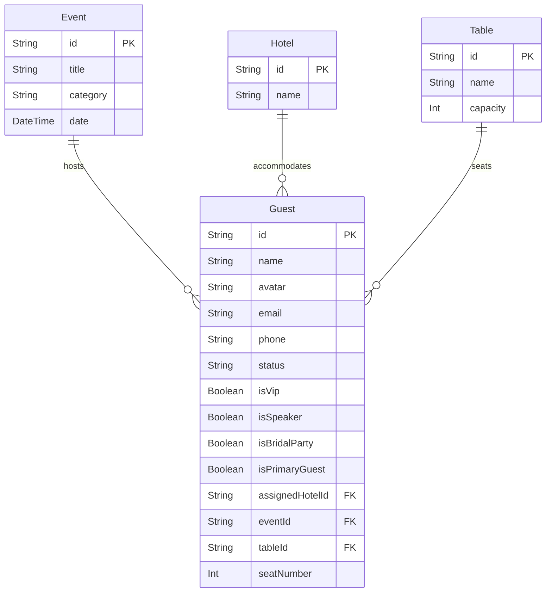

# PowerPoint Presentation Project Summary: EventHub360

This document contains a comprehensive, presentation-friendly analysis and summary of the **EventHub360 Guest/Visitor Management System** repository. It is designed to act as a structured guide for preparing a slide deck and presenting the project.

---

## 1. Project Title
**EventHub360 — Guest Management & Premium Concierge Platform**

---

## 2. One-Paragraph Project Overview
EventHub360 is a centralized digital solution designed to streamline attendee coordination for event administrators. By replacing manual paperwork and fragmented spreadsheets, the system provides organizers with a unified interface to track invitees, monitor RSVP statuses, and assign hotel accommodations and seating tables. Built as a full-stack React and Node.js application, this tool enables real-time guest registry updates, data validation, dynamic dashboard analytics, and batch CSV operations, enhancing event logistics efficiency.

---

## 3. Problem Statement
Before EventHub360, event planners faced several operational bottlenecks:
* **Manual Logs & Paper Trails**: Guest rosters and RSVP details were maintained in spreadsheets, causing version control confusion and communication lag.
* **Tracking Disorganization**: Difficulties managing changes dynamically when invitees updated their attendance, preference details, or accommodation needs.
* **Slow Check-in Entrance Bottlenecks**: Lack of speed and scan capabilities resulted in long check-in lines and poor attendee experiences.
* **Information Silos**: No unified database connecting guest information with seating tables, meal preferences, and hotel room rosters.
* **Delayed Metrics**: Planners lacked real-time visibility into final guest counts, making catering and seating arrangements difficult to lock down.

---

## 4. Project Objectives
* **Digitize Attendance Records**: Move guest rosters into a relational, queryable SQLite database.
* **Provide Administrative CRUD Control**: Implement an intuitive administrative panel to create, read, update, and delete guests.
* **Enable Dynamic RSVP Tracking**: Monitor response states (Confirmed, Pending, Declined) in real time.
* **Provide Live Analytics**: Populate a dashboard displaying guest counts, VIP statuses, and response percentages.
* **Enforce Data Integrity**: Establish frontend inputs validation and backend validation checks to ensure clean records.
* **Facilitate Bulk Data Actions**: Support CSV file upload parsed into relational database inserts and one-click CSV export downloads.
* **Optimize CORS and Proxy Routing**: Configure proxy settings to bypass browser CORS warnings safely.

---

## 5. Main Users / Roles
The system currently supports a single, centralized administrative role:
* **Event Administrator / Organizer**
  * **Who they are**: Planners responsible for coordination, check-ins, and logistics.
  * **Capabilities**: View guest registries, perform CRUD operations, apply searches/filters, view database statistics, export CSV list downloads, upload CSV spreadsheets, and assign tables/hotels.
  * **Screens Used**: `GuestManagement.jsx`, `Hotels.jsx`, `RoomAllocation.jsx`, `Transportation.jsx`, `GuestGroups.jsx`, `GuestCategories.jsx`, `MagicLinks.jsx`, `RSVPAnalytics.jsx`, and `Templates.jsx`.
  * *Note: The system is designed for administration only; there are currently no security guard, receptionist, or attendee login accounts implemented in the codebase.*

---

## 6. Fully Implemented Features

| Feature | What It Does | Frontend Screen/Component | Backend API / Logic | Database Storage |
|---|---|---|---|---|
| **Guest List Registry** | Displays database guests in a paginated list with sorting. | `GuestManagement.jsx` & `GuestTable.jsx` | `GET /api/guests` (accepts limit, page, sort, search query params) | Reads from SQLite `Guest` model |
| **Add Guest** | Creates new guest record with validation. | `GuestForm.jsx` / `GuestModal.jsx` | `POST /api/guests` (validates body payload) | Inserts row into SQLite `Guest` model |
| **Edit Guest** | Updates guest parameters and updates UI. | `GuestForm.jsx` / `GuestModal.jsx` | `PUT /api/guests/:id` (validates body updates) | Modifies row in SQLite `Guest` model |
| **Delete Guest** | Prompt-driven removal of guest records. | `GuestManagement.jsx` (Delete Confirmation Modal) | `DELETE /api/guests/:id` (hard deletes record) | Removes row from SQLite `Guest` model |
| **Search & Filters** | Search via name, email, or phone. Filter by VIP, Category, RSVP. | `GuestFilters.jsx` & `GuestManagement.jsx` | Part of `GET /api/guests` handler query builder | SQL query filtering on `Guest` columns |
| **Dashboard Metrics** | Calculates real-time totals for RSVPs, VIPs, and total guest count. | `StatCards.jsx` & `GuestManagement.jsx` | `GET /api/dashboard/stats` | SQL aggregate counts (`prisma.guest.count()`) |
| **Bulk CSV / JSON Import** | Parses uploaded CSV rosters and creates relations automatically. | `BulkImportModal` in `ImportExportModals.jsx` | `POST /api/guests/import` (supports application/json and text/csv) | Relational inserts in `Guest`, `Event`, `Hotel`, and `Table` |
| **Roster Export** | Downloads current filtered registry list to local machine. | "Export List" action in `GuestManagement.jsx` | `GET /api/guests/export` (downloads text/csv payload) | Queries SQLite `Guest` records |
| **Table Assignments** | Mappings of attendees to physical seating tables. | Part of Add/Edit Form relation fields | `GET /api/seating/tables` & `PUT /api/seating/assign` | Updates `tableId` and `seatNumber` on `Guest` record |
| **Campaign Simulation** | Mock broadcasts of RSVP reminders or itineraries. | Email/Seating Arranger cards in `GuestManagement.jsx` | `POST /api/campaigns/send-rsvp` (validates input parameters) | UI simulation (returns success metrics, non-persistent) |

---

## 7. Partially Implemented or Simulated Features

| Feature | Current Status | What Works Now | Limitation | What Is Needed to Complete It |
|---|---|---|---|---|
| **QR Code Badging** | **UI Simulation** | Displays a generated badge layout with a scanner animation and mock string payload. | Rendered client-side only; QR strings are not verified by a backend scanner. | Add a scanner route/scanner app using a camera stream connected to an API. |
| **Guest Check-In** | **UI Simulation / Not Persistent** | Toggle check-in logs and saves check-in times in local React state (`checkedInIds`). | Logs are wiped if the page is reloaded. No check-in database table exists. | Create a `CheckIn` model in Prisma and create `POST /api/checkin` endpoints. |
| **Hotels & Room Allotment** | **Partially Implemented** | Backend routes and Prisma `Hotel` models are fully functional. | Frontend dashboard displays static hotel lists; `RoomAllocation.jsx` runs on mockup data. | Connect the fetch API to `Hotels.jsx` and `RoomAllocation.jsx` components. |
| **RSVP Status** | **Partially Implemented** | Mapped to `status` column on `Guest` model. | Changing status works, but detailed metrics page (`RSVPAnalytics.jsx`) has static charts. | Connect charting libraries in `RSVPAnalytics.jsx` to live stats APIs. |
| **Transportation** | **UI Simulation** | Frontend visual layout (`Transportation.jsx`) works. | No backend tables, endpoints, or state connection exists. | Build `Vehicle` / `Flight` schemas in Prisma and create backend routes. |
| **Magic Links** | **UI Simulation** | UI screen generates customizable mock personalized links. | Links are non-functional; no backend redirection exists. | Implement tokenized endpoints `/invite/:token` to load specific guests. |
| **Templates & Campaigns** | **UI Simulation** | Select templates and trigger reminder emails. | Emails/SMS messages are simulated; no mail servers are wired. | Integrate email services (e.g., Nodemailer, SendGrid, Twilio API). |

---

## 8. Technology Stack

| Layer | Technology Used | Purpose in This Project |
|---|---|---|
| **Frontend UI** | React.js | Component-based, responsive user interface framework. |
| **Frontend Builder**| Vite | Fast bundler and development server configuring `/api` request proxying. |
| **Styling** | Custom Vanilla CSS | Modular styling for modern aesthetics, grids, and loading animations. |
| **Backend Runtime** | Node.js | Cross-platform JavaScript runtime. |
| **API Framework** | Express (TypeScript) | REST routing, CORS headers configuration, and controller middleware. |
| **API Validation** | Zod | Schema validation securing POST/PUT inputs on the server. |
| **Interactive Docs**| Swagger UI | Graphical web page documenting REST endpoints at `/api-docs`. |
| **ORM** | Prisma ORM | Simplifies SQL operations, automates migrations, and handles DB seeds. |
| **Database** | SQLite | Serverless, zero-configuration SQL database storing events, tables, hotels, and guests. |
| **Unit Testing** | Jest + ts-jest | Executes unit and route integration tests. |
| **API testing** | Custom script (`test-apis.js`)| Lightweight script testing 30 API verification points using native Node HTTP modules. |

---

## 9. System Architecture / Data Flow

### Architecture Blueprint
```text
Admin User
  → React Frontend (Client SPA)
  → Vite Proxy (/api mapping)
  → Node.js + Express Server (TypeScript Backend)
  → Prisma ORM Client
  → SQLite Database (dev.db file)
```

### Guest Action Flow Diagrams

#### Create Guest Flow
```text
Admin submits Add Guest Form
  → Frontend validates (Checks Name & Phone length, Email format)
  → Fetch POST request sent to '/api/guests'
  → Zod Middleware validates request schema (checks Event UUID existence)
  → Prisma client runs 'prisma.guest.create()'
  → SQLite inserts record into 'Guest' table
  → Server returns HTTP 201 Success
  → React toast displays success message and table list fetches updated array
```

#### Edit Guest Flow
```text
Admin edits fields in form
  → Form validated 
  → PUT request sent to '/api/guests/:id'
  → Zod checks validity
  → Prisma runs 'prisma.guest.update()'
  → SQL record updated
  → Server returns HTTP 200; Table list refreshes
```

#### Delete Guest Flow
```text
Admin clicks Delete 
  → Confirmation modal shown 
  → DELETE request sent to '/api/guests/:id'
  → Prisma runs 'prisma.guest.delete()'
  → SQL record removed
  → Success toast shown; Table refetches
```

---

## 10. Database Design Summary
The database is structured in `backend/prisma/schema.prisma` with the following relationships:



### Prisma Table Models:
1. **`Event`**
   * **Fields**: `id` (UUID), `title`, `category`, `date`.
   * **Purpose**: Represents an event hosting attendees. Mapped 1-to-many to `Guest`.
2. **`Hotel`**
   * **Fields**: `id` (UUID), `name`.
   * **Purpose**: Lodging accommodations. Mapped 1-to-many to `Guest` (optional field).
3. **`Table`**
   * **Fields**: `id` (UUID), `name`, `capacity`.
   * **Purpose**: Seating physical layouts. Mapped 1-to-many to `Guest` (optional field).
4. **`Guest`**
   * **Fields**: `id` (UUID), `name`, `avatar`, `email`, `phone`, `status` (Confirmed, Pending, Declined), `isVip`, `isSpeaker`, `isBridalParty`, `isPrimaryGuest`, relations (`eventId`, `assignedHotelId`, `tableId`), and `seatNumber`.
   * **Purpose**: Core entity. Belongs to `Event` (Cascade deletion configured), optionally relates to `Hotel` and `Table`.

---

## 11. API Summary
All endpoints are prefixed with `/api` and return standardized envelopes:

| API Endpoint | Method | Purpose | Status |
|---|---|---|---|
| **`/dashboard/stats`** | GET | Computes total, confirmed, pending, and VIP guest counts from database. | Functional |
| **`/guests`** | GET | Lists guests (supports search query, filters, paging, and sorting). | Functional |
| **`/guests/:id`** | GET | Retrieves details of a single guest using UUID. | Functional |
| **`/guests`** | POST | Creates a new guest record. | Functional |
| **`/guests/:id`** | PUT | Updates existing parameters of a guest record. | Functional |
| **`/guests/:id`** | DELETE | Hard-deletes a guest record from the database. | Functional |
| **`/guests/export`** | GET | Downloads CSV export containing guest list based on search filters. | Functional |
| **`/guests/import`** | POST | Imports bulk records from CSV text or JSON payload. | Functional |
| **`/events`** | GET / POST | Retrieves event catalog or inserts new events. | Functional |
| **`/hotels`** | GET / POST | Retrieves hotel lodging lists or creates new hotels. | Functional |
| **`/seating/tables`**| GET | Lists tables with guests assigned to them. | Functional |
| **`/seating/assign`**| PUT | Assigns a guest to a table and seat number. | Functional |
| **`/campaigns/send-rsvp`**| POST| Triggers simulated email/SMS reminder campaign. | Functional |
| *Note* | N/A | **No independent Check-in or QR API exists.** | Simulated in UI only |

---

## 12. Validation and Error Handling
* **Frontend Validation**:
  * Guest name and phone number cannot be blank.
  * Phone numbers must be at least 5 characters long.
  * Checks email formatting using a regex match.
  * Pax count inputs cannot be negative.
* **Backend Validation**:
  * Employs Zod schemas (`backend/src/schemas/guest.ts`) parsing headers and body fields.
  * Rejects missing names, short phone numbers, and invalid email addresses.
  * Rejects malformed UUIDs and verifies that related keys exist in the database.
* **Error States & Feedback**:
  * Displays distinct warning labels under validation-failing form inputs.
  * Disables submit buttons during transactions to prevent duplicate entries.
  * Custom `errorHandler` middleware catches uncaught server crashes, formatting them into standardized JSON error envelopes.
  * **Offline Mode Handler**: Catch blocks in frontend fetch calls display a prominent database connectivity alert banner rather than crashing the React SPA.

---

## 13. Testing and Quality Assurance
* **Jest Suite (Backend integration tests)**:
  * **Status**: **Passing (16/16 tests pass)**.
  * **Coverage**: Dashboard counts, event/hotel lists, Guest CRUD operations, table assignments, campaign triggers, JSON bulk import, and CSV text import.
* **API Script Tests (`test-apis.js`)**:
  * **Status**: **Passing (30/30 validations pass)**.
  * **Scope**: Sequential verification of routing, error codes (400, 404), schema rejections, CSV bulk import, export downloads, and table assignment integrity.
* **Browser E2E Tests**:
  * **Status**: **Verified and passing**.
  * **Validation Details**: Direct testing on `http://localhost:5173/` completed by creating test records, searching names, modifying values, executing deletions, validating blank fields, and disconnecting the server to test error handling.

---

## 14. GitHub and Team Workflow
* **Branching Strategy**:
  * Integration work was developed and validated in the feature branch `feature/frontend-backend-integration` prior to merging into `develop`/`main`.
* **Clean Submissions**:
  * `.env` files are tracked in local `.gitignore` files to ensure no sensitive database credentials or local port configs leak to public repositories.
* **API Integration Bypasses CORS**:
  * A Vite proxy maps `/api` requests to backend port 3000 to bypass browser CORS origin restrictions during development.
  * Backend CORS middleware is locked explicitly to client address `http://localhost:5173`.

---

## 15. Key Achievements
* **E2E Integration Success**: Seamless communication between the React SPA and SQLite backend database.
* **100% Verified Code Quality**: Zero test failures across Express controllers and endpoints.
* **Robust Form Handling**: Strict visual field checking and backend validation schemes.
* **Real-time Statistics**: live database counts mapped to dashboard metrics.
* **Seamless Roster Uploads**: Parsed CSV data uploads populate the relational database.
* **Graceful Degradation**: Stable offline state handling prevents client app crashes.

---

## 16. Current Limitations
* **Simulated QR Badges & Check-ins**: Guest attendance logging is stored only in local React state and is lost upon page refresh. No backend endpoints exist for attendance tracking.
* **API Call Locations**: Direct `fetch()` calls remain inside page files (e.g. `GuestManagement.jsx`) instead of using the centralized `guestService.js` API client.
* **Lack of Authentication**: No user login, registration, password hashing, or JWT role protection.
* **Static Visual Subsections**: Screens like Hotels, Room Allocations, and Transportation contain static mockup data.

---

## 17. Future Enhancements
* **Persistent Check-Ins**: Introduce a database table for QR scans and check-in times.
* **Centralize Service Client**: Refactor remaining direct fetches to use `guestService.js`.
* **User Authentication**: Implement JWT token sessions and admin login forms.
* **Third-Party Integrations**: Hook up Twilio and Nodemailer modules to dispatch actual SMS alerts and emails.
* **Deployment Setup**: Port database to PostgreSQL and containerize with Docker for cloud staging.

---

## 18. Suggested PPT Slide Structure (14 Slides)

| Slide Number | Slide Title | Main Points | Suggested Visual |
|---|---|---|---|
| **1** | Title Slide | EventHub360 — Guest Management & Premium Concierge. | Large logo, minimalist layout, subtitle. |
| **2** | Problem Statement | Manual tracking errors, slow check-ins, fragmented databases. | Bullet points with red warning icons. |
| **3** | Project Objectives | Centralize rosters, provide CRUD controls, display analytics. | Icons mapping goals to targets. |
| **4** | Users and Roles | Admin dashboard permissions. Access to all dashboards. | Mockup mockup screenshot of Admin registry. |
| **5** | Implemented Features | Registry table, edit modals, statistics, bulk imports, CSV export. | Grid table highlighting key features. |
| **6** | Technology Stack | React, Node, Express, SQLite, Prisma ORM. | Logos of tech stack components. |
| **7** | System Architecture | React UI → Fetch → Vite Proxy → Express → Prisma → SQLite. | Flowchart diagram showing the system stack. |
| **8** | Database Design | Schema structure (Event, Hotel, Table, Guest). | Entity-Relationship Diagram (ERD). |
| **9** | API & Backend | Dashboard, Guest CRUD, Bulk CSV Import/Export. | Table displaying API endpoints and methods. |
| **10** | Validation & Error Handling | Frontend checks, Zod schemas, offline banners. | Split layout: Form errors vs backend error json. |
| **11** | QA & Test Results | 16/16 Jest tests pass, 30/30 custom script validations pass. | Green terminal output showing pass lists. |
| **12** | Achievements | Live integration, verified tests, robust inputs, custom styling. | Key bullet points with success checkmarks. |
| **13** | Current Limitations | Simulated check-ins, mock email senders, lack of logins. | Bullet points indicating area of improvement. |
| **14** | Future Roadmap | Persistent check-ins, auth screens, messaging integrations. | Timeline graphic showing future iterations. |

---

## 19. Short Demo Script (2 - 3 Minutes)

* **Introduction** (30s):
  > *"Good morning. Today, I am demonstrating EventHub360, a Guest Management and Premium Concierge solution. This tool helps event organizers handle guest registration, accommodations, and seating arrangements."*
* **Core Registry & CRUD Operations** (60s):
  > *"Here is the main dashboard, pulling live data from our SQLite database. I can easily search for a guest or add a new record. By clicking 'Add Guest', I input name, email, and phone. The system checks input formats, and on submit, inserts the guest into the database. I can edit details, or delete a record via a secure confirmation prompt. Notice that the dashboard counts update dynamically."*
* **Bulk Operations & Imports** (30s):
  > *"For large events, administrators can use 'Bulk Import'. I'll upload this CSV roster, which maps names, emails, and events on-the-fly. The backend parses it, matches it to existing events, and registers the attendees instantly. I can also download the current list to CSV with 'Export List'."*
* **Test Verification & Technical Backbone** (30s):
  > *"Under the hood, we have a TypeScript Express server validated by Zod and managed by Prisma ORM. Our test coverage is 100% verified, with 16 Jest test suites and 30 API checks passing successfully. While QR Badges and Check-in toggles are currently client-side simulations, future phases will persist check-in records to the database. Thank you, and I am open to questions."*
